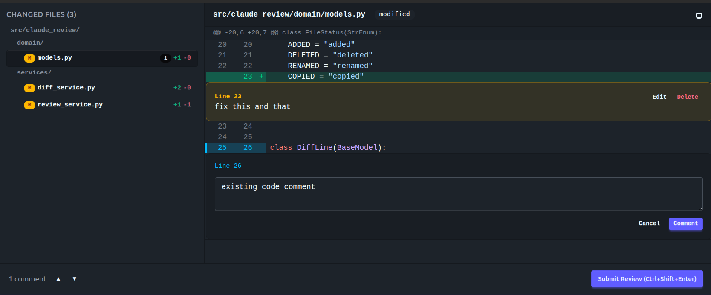

# Claude Review

Browser-based code review tool for Claude Code. Shows git diffs in a GitHub-style UI with syntax highlighting, lets you write inline comments (single-line or drag to select ranges), and sends formatted feedback back to Claude.



## Quick Start

**Option A** — cross-platform (Claude Code, Cursor, Codex, and 40+ agents):
```bash
npx skills add vrppaul/claude-review -g -y
```

**Option B** — Claude Code plugin marketplace:
```
/plugin marketplace add vrppaul/claude-review
```

Type `/review-ui` and the CLI is installed automatically on first use.

### Manual CLI install (optional)

If you prefer to install the CLI yourself:

```bash
uv tool install git+https://github.com/vrppaul/claude-review
```

Then you can run it directly:

```bash
claude-review              # opens browser with diff of current changes
claude-review --port 8080  # specific port
claude-review --no-open    # don't open browser automatically
claude-review --verbose    # enable diagnostic logging to stderr
claude-review /path/to/repo
```

## How It Works

```
You type /review-ui in Claude Code
  → Server starts, browser opens with current diff
  → You read diff, add inline comments on any line
  → You click Submit (or Ctrl+Shift+Enter)
  → Browser closes, formatted comments appear in Claude's context
  → Claude reads feedback and makes the requested changes
```

## Features

- GitHub-style diff view with syntax highlighting
- Click to comment on any line, drag for multi-line ranges
- File tree sidebar with change stats (+/- per file)
- Comment navigation (prev/next buttons)
- Light/dark theme (auto-detects system preference, manual toggle)
- Auto-shutdown when browser tab is closed
- Works with tracked, staged, and untracked files

## Development

```bash
# Python
uv sync                          # install dependencies
uv run pytest                    # run all tests (unit + integration + e2e)
uv run ruff check src/ tests/    # lint
uv run ty check src/             # type check

# Frontend
cd frontend && pnpm install      # install dependencies
cd frontend && pnpm build        # build (outputs to src/claude_review/static/dist/)
cd frontend && pnpm test         # run tests
cd frontend && pnpm lint         # lint
cd frontend && pnpm check        # type check
```

## License

MIT
