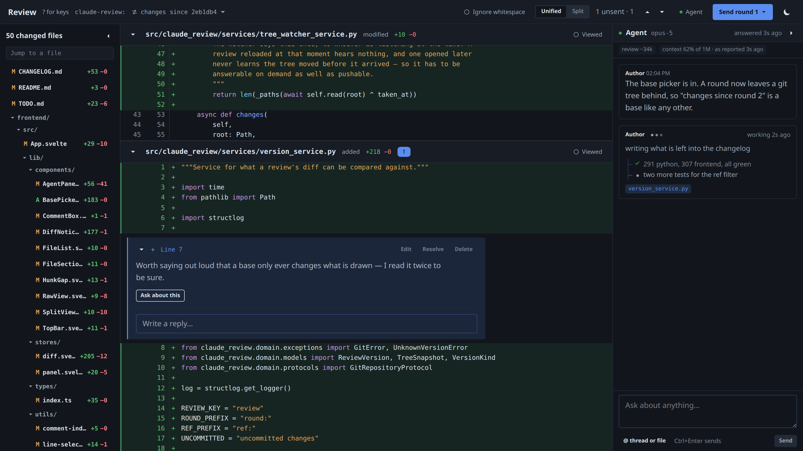

# Claude Review

Browser-based review tool for Claude Code. Add inline comments on code changes, text files, or conversation transcripts, and send structured feedback back to Claude.



## Quick Start

**Option A** — cross-platform (Claude Code, Cursor, Codex, and 40+ agents):
```bash
npx skills add vrppaul/claude-review -g -y
```

**Option B** — Claude Code plugin marketplace:
```
/plugin marketplace add vrppaul/claude-review
```

Type `/review-ui` and the CLI is installed automatically on first use.

## Review Modes

### Diff mode (default)

Review current git changes in a GitHub-style diff view.

```
/review-ui
```

Shows all uncommitted changes (tracked, staged, and untracked) with two-column line numbers, add/delete highlighting, and a file tree sidebar.

### Files mode

Review any text files — plans, docs, configs, source code.

```
/review-ui plan
```

Opens the current plan file for inline review before approving. You can also review arbitrary files from the CLI:

```bash
claude-review --files plan.md
claude-review --files design.md api.py schema.sql
```

Shows files with single-column line numbers, syntax highlighting based on file extension, and a flat file list sidebar.

### Transcript mode

Review a Claude Code conversation — every user and assistant message appears as a reviewable entry.

```
/review-ui transcript
```

Opens the current session's conversation for inline review. You can also review any JSONL conversation file from the CLI:

```bash
claude-review --transcript ~/.claude/projects/<project>/<session-id>.jsonl
```

Shows messages newest-first with timestamps, merges consecutive same-role entries into turns, and filters out tool calls and thinking blocks.

### How it works

```
/review-ui (or /review-ui plan, /review-ui transcript)
  -> Server starts, browser opens
  -> You read the content, add inline comments on any line
  -> Click Submit (or Ctrl+Shift+Enter)
  -> Browser closes, formatted comments appear in Claude's context
  -> Claude reads feedback and makes the requested changes
```

## Features

**Reading**

- The whole diff as one stream — every file on screen, the sidebar navigates by scrolling
- Unified or split layout, with what changed inside a replaced line marked word by word
- Show the lines a hunk left out, or leave whitespace-only changes out entirely
- Fold a file away, mark it viewed, filter the tree by path; drag the tree
  narrower or put it away entirely
- Syntax highlighting that reads a hunk whole, so a docstring stays a docstring
- Light and dark, remembered, following the system until you choose

**Commenting**

- Inline comments on a line or a dragged range, on either side of the diff
- Suggest a replacement rather than describing one
- Mark a comment as a question or a blocker
- Ask about a comment without leaving the review, and read the answer in the
  thread it belongs to — turns, speakers and a composer under the last one
- Resolve a thread that is settled; it goes out marked resolved
- A "Replies" list in the header counts answers you have not read, and the
  tab title says so from a background tab
- Send a round rather than ending the review: the threads stay on screen, the
  agent answers and makes the changes, and the diff is taken again beneath
  them — a thread whose lines moved follows them, one whose lines are gone
  says so
- Comments survive a reload, and a review reopened on the same repository
  comes back on the same port, so an unsent draft is still there

**Talking to the agent**

- A panel on the right for what a thread is not about — the plan, the tests, a
  file nobody commented on. It reaches the same agent that answers the threads
- Point at a thread with `@`, and its lines, comment and turns travel with the
  message
- Two numbers, told apart: what handing the review over costs, and how much
  context the agent says it has left
- The agent can point at a line itself: a thread in its own colour, on the
  code rather than in a paragraph elsewhere, which you answer or settle like
  any other
- Watch what the agent is doing while it does it: a live line saying which
  files are in hand, replaced as it changes and gone when the work is
- The agent can speak first — work finished while you were reading arrives
  with a dot on the header chip, a count in the tab title and an optional tick
- Jump to a file the agent names, or be taken there and shown it
- Point at a thread or any file with `@`, and it travels with the message
- Stop a message the agent is still working on — a request, not a kill
- When the working tree moves on, the review says so and offers to take the
  diff again. It never swaps it under a half-written comment

**Keyboard**

- `j` / `k` between lines, `Enter` to comment, `]` / `[` between files
- `n` / `p` between comments, `a` to the next unread reply
- `v` viewed, `u` fold, `?` for the list

## CLI Reference

```bash
claude-review diff                         # diff mode — review git changes
claude-review diff /path/to/repo           # diff mode — specific repository
claude-review diff --base HEAD~3           # diff since a specific commit
claude-review diff --base v0.5.0           # diff since a tag
claude-review files plan.md                # files mode — review text files
claude-review files a.md b.py c.rs         # files mode — multiple files
claude-review transcript conv.jsonl        # transcript mode — review conversation
claude-review wait --port 8765             # wait for a question, a message or a round
claude-review reply --port 8765 --thread <id> --question <id> "..."   # answer in a thread
claude-review say --port 8765 --message <id> "..."                    # answer in the panel
claude-review status --port 8765 --model opus-5 --context "53% of 1M" # what only the agent knows
claude-review point --port 8765 --file a.py --lines 42-47 "..."       # raise a thread on a line
claude-review progress --port 8765 --message <id> --file a.py "..."   # what you are doing now
claude-review show --port 8765 --file a.py                            # take the reader to a file
claude-review context --port 8765                                     # catch up on a review under way
claude-review round --port 8765            # retake the diff after a round
claude-review --port 8080 diff             # shared options before subcommand
claude-review --no-open diff               # don't open browser automatically
claude-review --verbose diff --base HEAD~1 # enable diagnostic logging
claude-review --version                    # print the installed version
```

### Answering from the review

While a review is open, any comment can carry a question, and the panel
carries everything that belongs to no comment. These commands let the agent
that wrote the change be the one that answers:

```bash
claude-review wait --port 8765             # block until something is said
claude-review reply --port 8765 --thread comment-3 "Because it moved to config"
claude-review say --port 8765 --message panel-1 "One failed; fixed and green"
```

`wait` prints one JSON object and exits — a question, a panel message, a
round, or `{"type":"timeout"}` if nothing was said — so it can be driven from
a loop. The `/review-ui` skill documents the loop.

### Manual install (optional)

```bash
uv tool install claude-review
```

Ships as a prebuilt wheel on [PyPI](https://pypi.org/project/claude-review/) — no Node or pnpm required.

## Development

```bash
# Python
uv sync                          # install dependencies
uv run pytest                    # run all tests (unit + integration + e2e)
uv run ruff check src/ tests/    # lint
uv run ty check src/             # type check

# Frontend
cd frontend && pnpm install      # install dependencies
cd frontend && pnpm build        # build (outputs to src/claude_review/static/dist/)
cd frontend && pnpm test         # run tests
cd frontend && pnpm lint         # lint
cd frontend && pnpm check        # type check
```

## License

MIT
